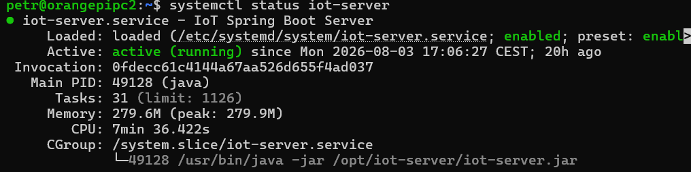
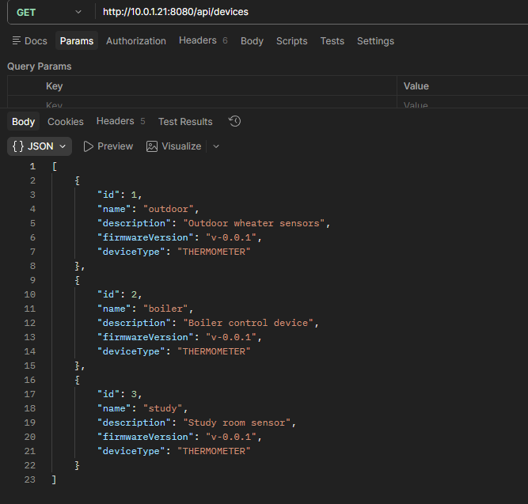
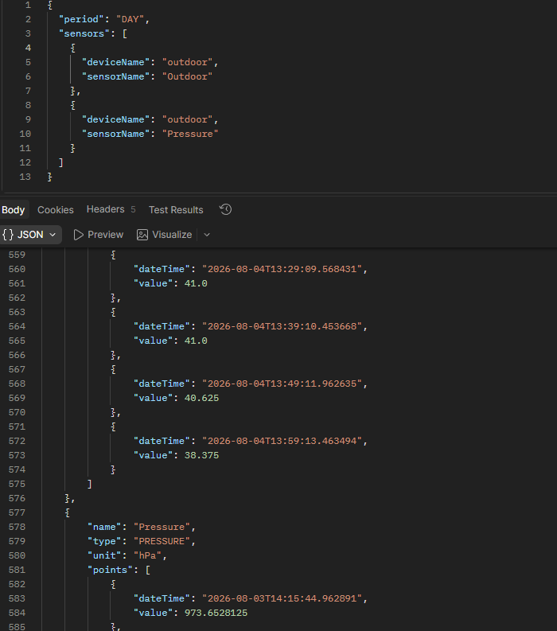
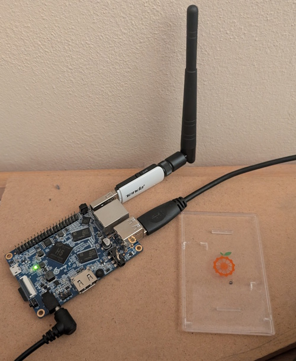

# IoT Server

IoT Server is a Spring Boot backend designed for communication with ESP32-based IoT devices over HTTP.

It provides a lightweight and extensible platform for device management, telemetry collection and command execution. The project serves as a reusable foundation for home automation, environmental monitoring and future IoT applications.

---

## Quick Links

📦 **IoT Server Repository**

https://github.com/FD-technic/iot-server

📦 **IoT Devices Repository**

https://github.com/FD-technic/iot-devices

---

# Deployment

The application is deployed as a **systemd** service on a Linux-based Orange Pi.

### Running Service



---

# REST API

### Registered Devices

The server provides a REST endpoint for device management.



---

### Historical Sensor Data

Historical measurements can be queried through the REST API.



---

# Hardware

### Orange Pi Server



---

### ESP32 Weather Station


---

### ESP32 Temperature Sensor


---


# Features

- REST API for IoT devices
- Generic device communication protocol
- JSON-based communication
- Stateless REST architecture
- Command-based responses
- Health endpoint
- Linux deployment
- Extensible payload architecture
- Ready for PostgreSQL integration
- Ready for React dashboard integration

---

# Tech Stack

- Java 21
- Spring Boot
- Maven
- Jackson
- REST API
- Docker
- Linux
- Git
- GitHub

---

# Architecture

```text
ESP32 Device
      │
 JSON over HTTP
      ▼
Spring Boot REST API
      │
 Business Logic
      │
 Command Processing
      │
 JSON Response
      ▼
ESP32 Device
```

---

# Getting Started

## Requirements

- Java 21+
- Maven

---

## Build

```bash
mvn clean package
```

---

## Run

```bash
java -jar target/iot-server.jar
```

---

# API

## Health Endpoint

```http
GET /api/health
```

---

## Communication Endpoint

```http
POST /api/device
```

Devices send telemetry data and receive commands in the response.

---

# Project Status

## Implemented

- REST communication
- Device protocol
- Command architecture
- Health endpoint
- Linux deployment

## Planned

- Device registration
- PostgreSQL persistence
- Configuration management
- React dashboard
- Historical charts
- OTA firmware updates
- MQTT support

---

# Documentation

- architecture.md
- roadmap.md

---

# License

MIT